# OAuth2 Setup Guide

To set up Google OAuth2 for your application, follow these steps:

1. **Create a Google Cloud Project**  
    - Go to the [Google Cloud Console](https://console.cloud.google.com/).

   - Click on the project drop-down and select "New Project".
    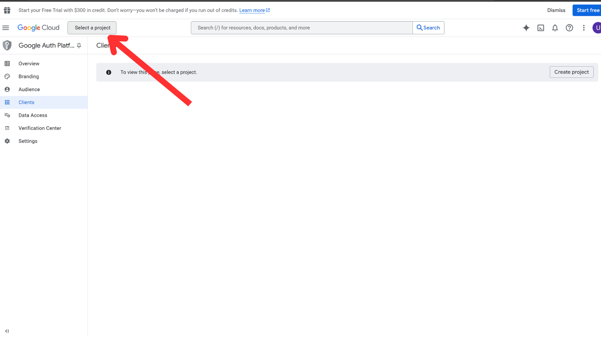
    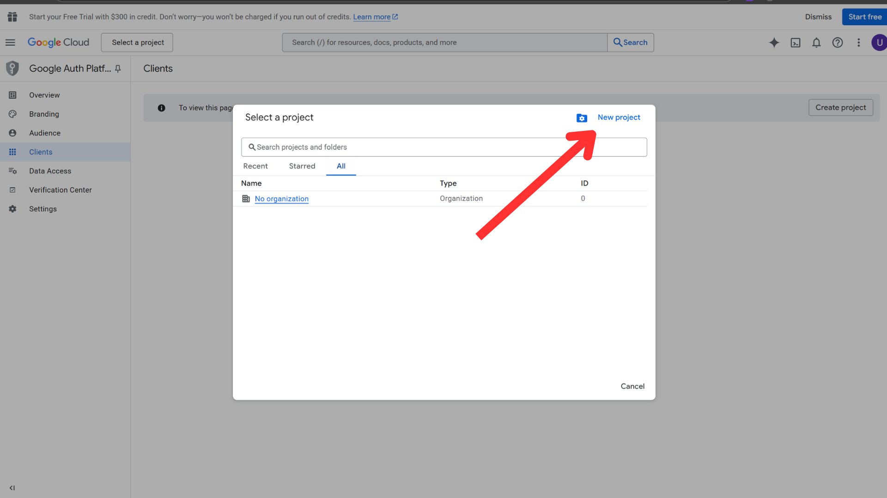
   - Enter a project name and click "Create".
   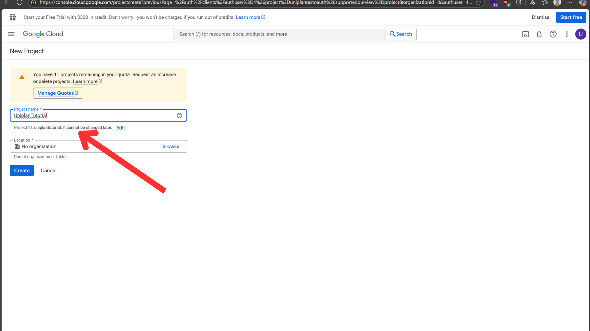

2. **Client , Project Configuration**  
    - after creating project click "client " on side menu and select "Get Started" to setup OAuth consent screen.
    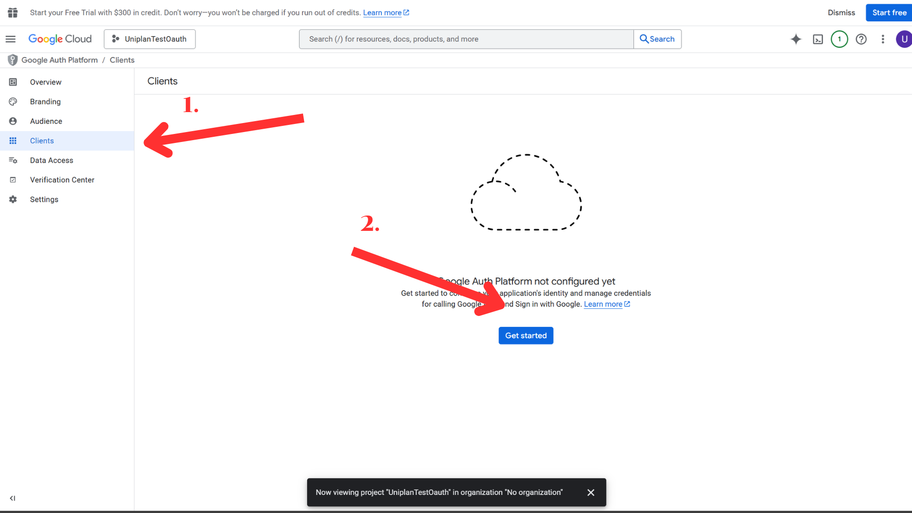
    - Fill information and select "External" and click "Create".
    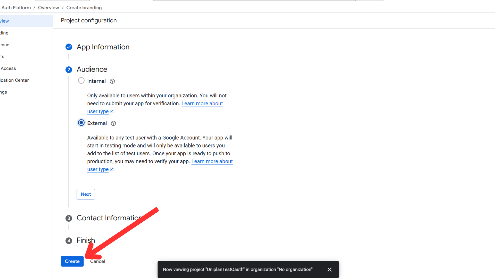
3. **OAuth Consent Screen Configuration**  
    - Go to "Overview" and click "Create Oauth Client".
    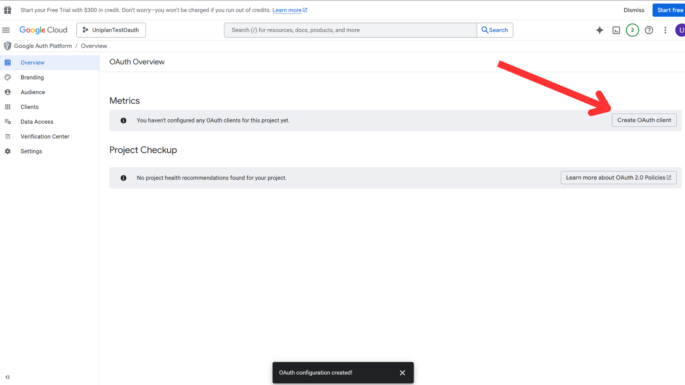
    - Select "Web application" as the application type and put your project name.
    - In "Authorized javascript origins", add:

      ```
      http://localhost:5173
      http://127.0.0.1:5173
        ```

    - In "Authorized redirect URIs", add:

        ```
        http://127.0.0.1:8000/api/auth/google/callback
        http://localhost:8000/api/auth/google/callback
        ```

    - before create make sure that you add everything correctly as shown below *
    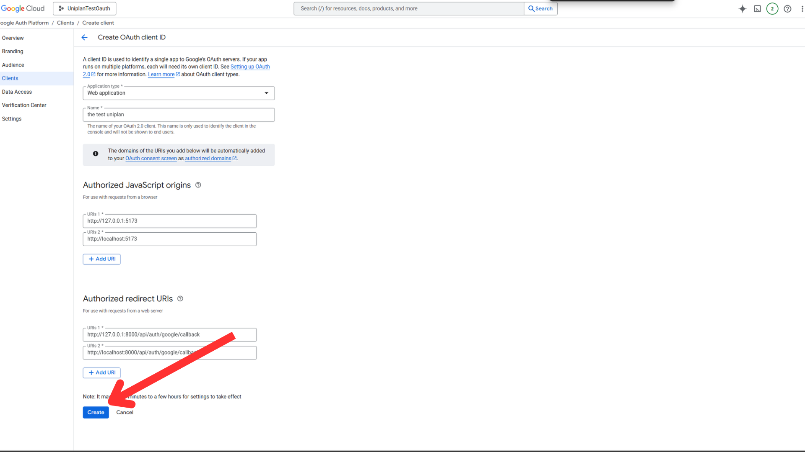
    - Click "Create" and save your credentials as json.
    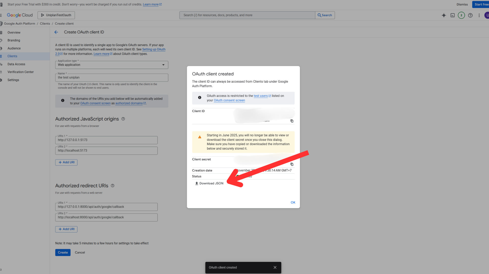
    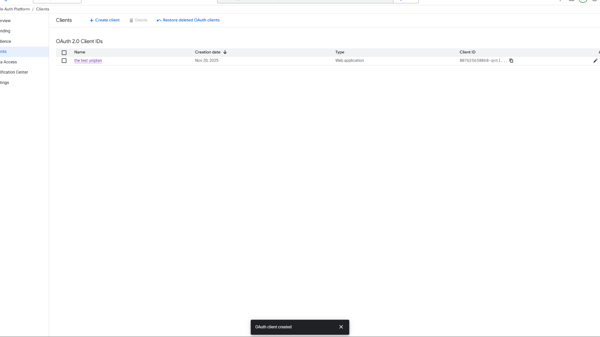
4. **Enable Google classroom API**  
    - Go to "Library" in side menu and search for "Google Classroom API".
    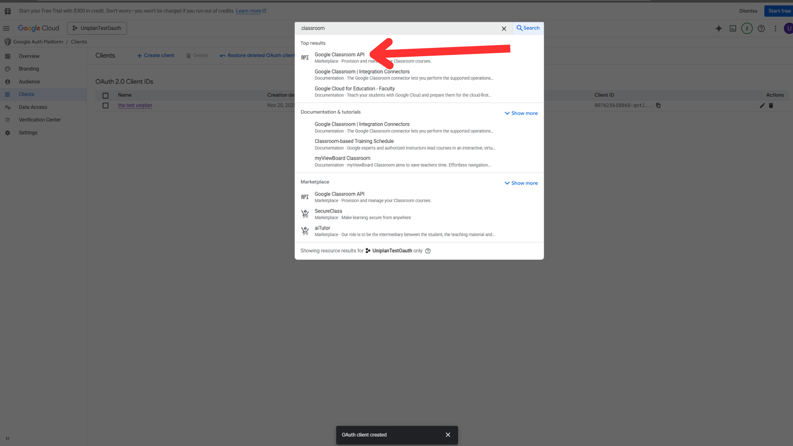
    - Click on it and then click "Enable".
    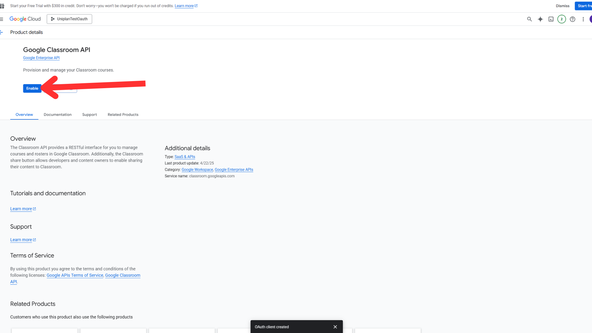
    - After enabling, go to "OAuth consent screen" in side menu. and
    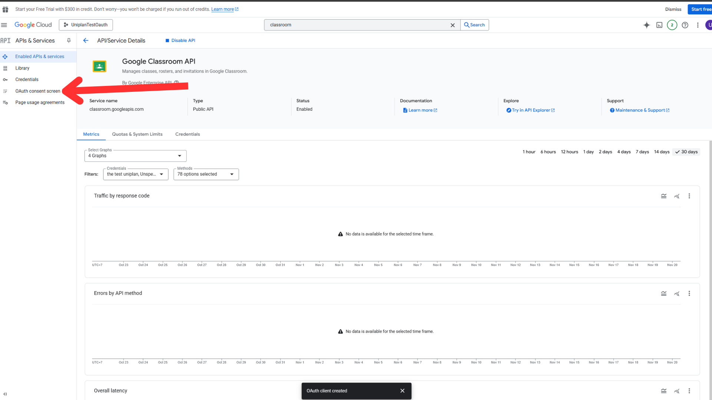
    - clcik "Data acessss" and select "add scope" and add the following scopes:
      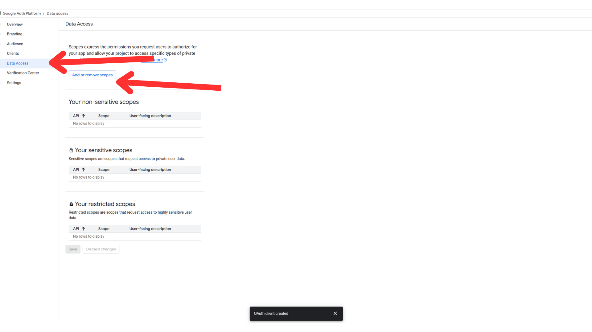
    - Adding these scopes will allow your application to access Google Classroom data on behalf of the users. one by one add all the scopes shown below:

    - <https://www.googleapis.com/auth/userinfo.email>
    - <https://www.googleapis.com/auth/userinfo.profile>
    - <https://www.googleapis.com/auth/classroom.courses.readonly>
    - <https://www.googleapis.com/auth/classroom.student-submissions.me.readonly>
    - <https://www.googleapis.com/auth/classroom.coursework.me>

      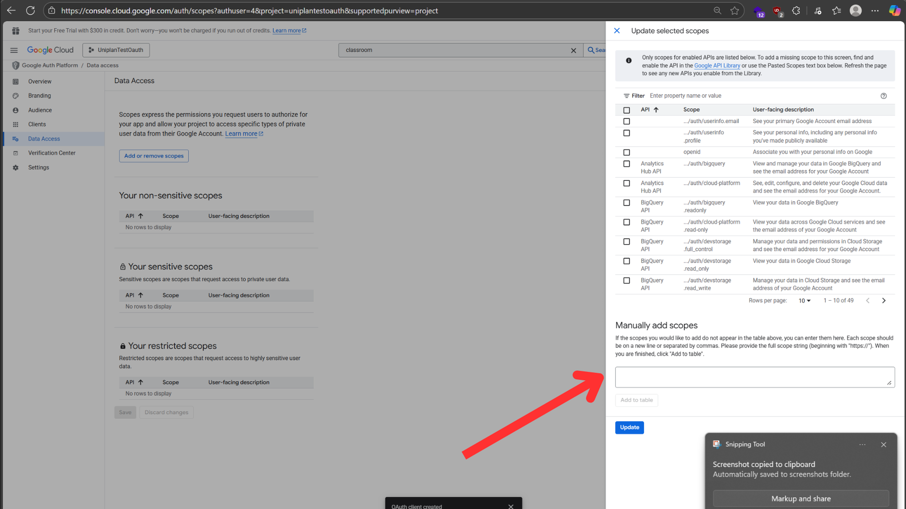
    - After adding all the scopes click "update & save".
    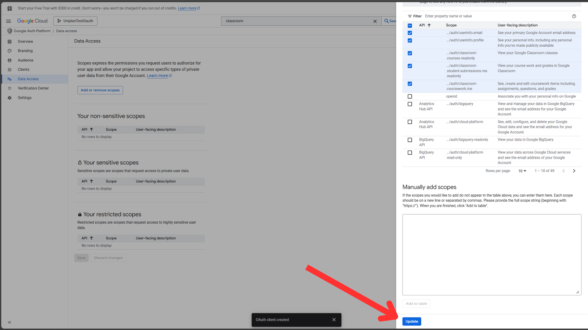
    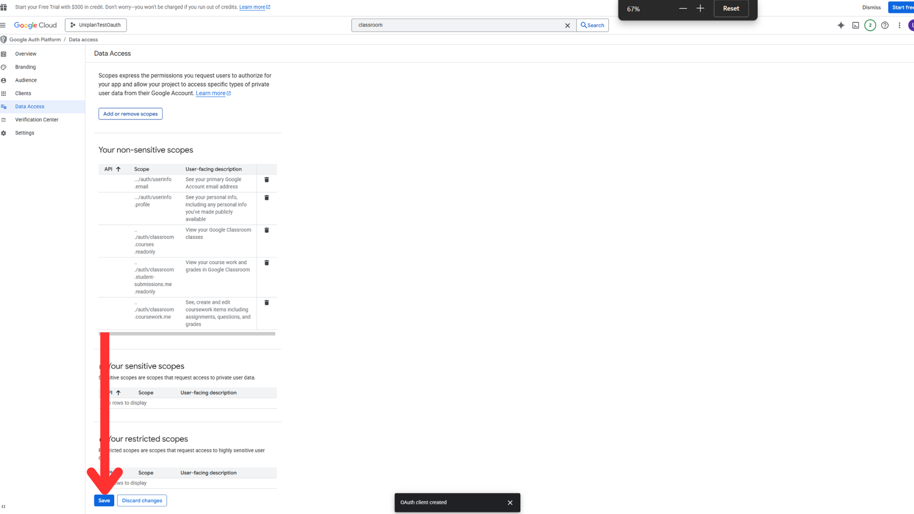
5. **Audience Setting**  
    - Go to your google auth platoform and select "Audience" from side menu.
    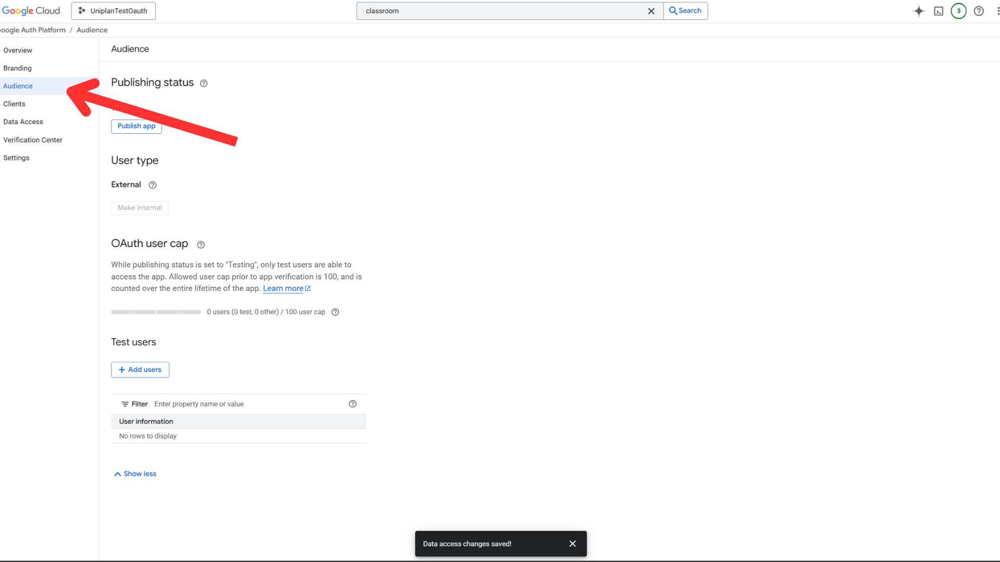
    - under plusblishing status click "Publish App" and confirm.
    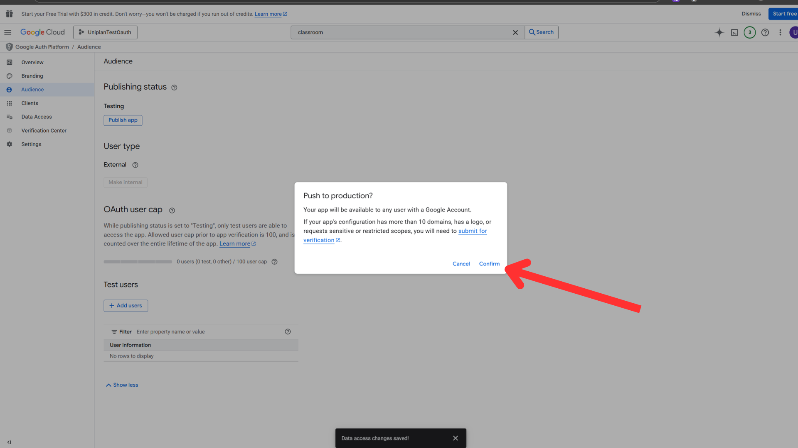
6. **Final Step**  
    - Go back to "Credentials" from side menu or the json that you download and copy your "Client ID" and "Client Secret" to your  backend `.env` file. from the steps in INSTALLATION.md and replace the following placeholders:

    ```env
    GOOGLE_CLIENT_ID=your_google_client_id_here
    GOOGLE_CLIENT_SECRET=your_google_client_secret_here
    ```

    - Now your Google OAuth2 setup is complete! You can now continue with the rest of the installation process to run your application.
